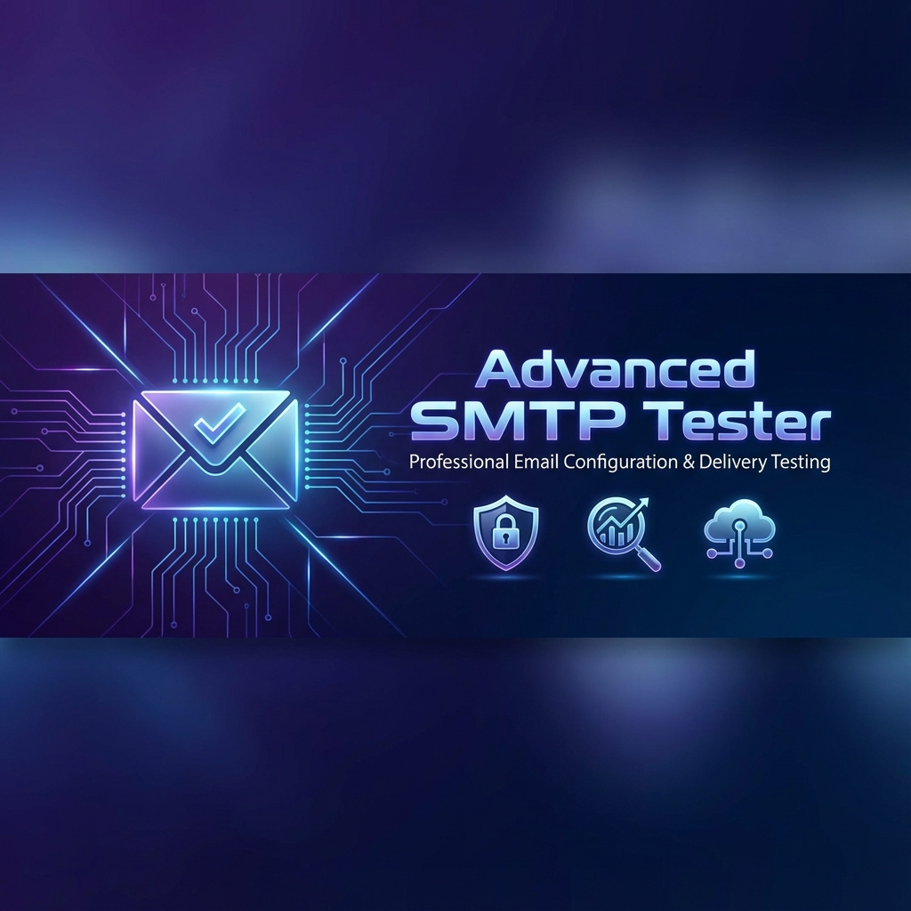
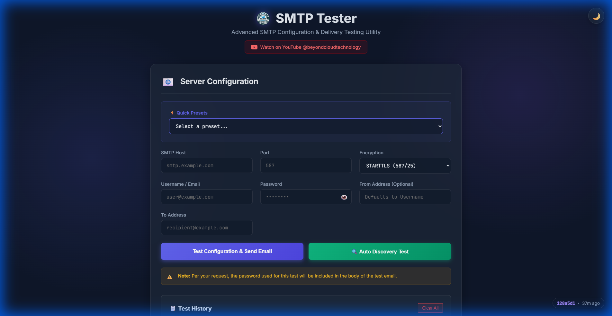
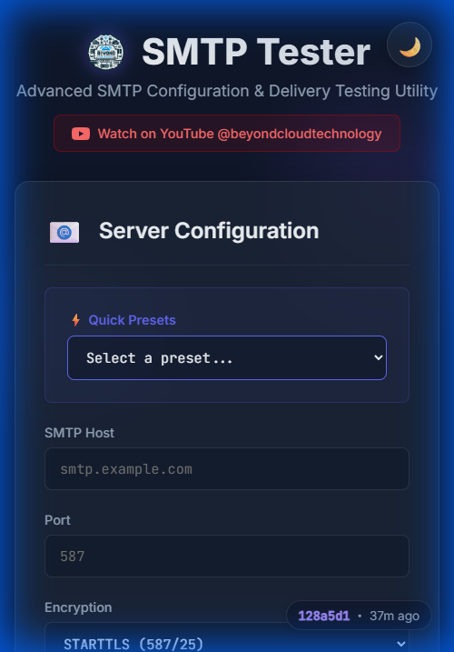

# 📧 Advanced SMTP Tester



**A professional, feature-rich SMTP testing utility for developers and system administrators.**  

Test SMTP configurations, troubleshoot connection issues, and validate email delivery with an elegant, intuitive interface.

<div align="center">

[](https://advanced-smtp-tester.beyondcloud.technology/)
[](https://github.com/DeNNiiInc/Advanced-Smtp-Tester)
[](LICENSE)

</div>

---

## 🌐 Live Demo

**Try it now:** [https://advanced-smtp-tester.beyondcloud.technology/](https://advanced-smtp-tester.beyondcloud.technology/)

---

## 📸 Screenshots

### Desktop View (1920x1080)


### Mobile View


---

## ✨ Key Features

### 🎨 **Premium User Experience**
- **Dark/Light Mode** - Seamless theme switching with persistence
- **Glassmorphism Design** - Modern, polished interface with smooth animations
- **Fully Responsive** - Perfect experience on desktop, tablet, and mobile devices
- **Git Version Badge** - Always know what version is deployed (bottom-right corner)

### ⚡ **Powerful Testing Capabilities**
- **Quick Presets** - Pre-configured settings for popular providers:
  - Microsoft Office 365
  - Google Gmail
  - SendGrid
  - Mailgun
  - Amazon SES
- **Auto-Discovery** - Automatically test multiple port/encryption combinations:
  - Ports: 25, 465, 587, 2525
  - Encryption: SSL/TLS, STARTTLS, Unencrypted
- **Enhanced Error Handling** - Intelligent error analysis with actionable troubleshooting tips

### 📊 **History & Insights**
- **Local Test History** - Automatically saves recent tests in browser storage
- **Detailed Logs** - View complete SMTP transaction logs and server responses
- **Click-to-Reload** - Quickly retest previous configurations

### 🔒 **Security & Privacy**
- **No Server Storage** - Credentials are processed in-memory only
- **Browser-Only History** - Test history stored locally (IndexedDB)
- **Clear Warning** - Password inclusion in test emails is clearly indicated

---

## 🚀 Installation Options

### Option 1: Use the Live Demo ✨ **Recommended**

No installation needed! Just visit:  
**[https://advanced-smtp-tester.beyondcloud.technology/](https://advanced-smtp-tester.beyondcloud.technology/)**

### Option 2: Run Locally (Node.js)

```bash
# Clone the repository
git clone https://github.com/DeNNiiInc/Advanced-Smtp-Tester.git
cd Advanced-Smtp-Tester

# Install dependencies
npm install

# Start the server
npm start

# Access at http://localhost:3000
```

### Option 3: Desktop App (Electron)

```bash
# Development mode
npm run electron

# Build Windows installer
npm run build
```

### Option 4: Automated Proxmox Deployment

For automated deployment to **TurnKey Linux Node.js** containers:

1. Create `deploy-secrets.json` (see `PROXMOX_DEPLOY_TEMPLATE.md`)
2. Run: `./deploy-to-proxmox.ps1`

Features automatic:
- Dependency installation (Git, Nginx, PM2, Cloudflared)
- Nginx reverse proxy configuration
- Auto-updates every 5 minutes via cron

📖 **[Full Deployment Guide](PROXMOX_DEPLOY_TEMPLATE.md)**

---

## 💡 Usage

### Quick Start
1. Visit [https://advanced-smtp-tester.beyondcloud.technology/](https://advanced-smtp-tester.beyondcloud.technology/)
2. Select a preset (e.g., "Microsoft Office 365")
3. Enter your credentials
4. Enter recipient email address
5. Click **"Test Configuration & Send Email"**

### Auto-Discovery Mode
Click **"Auto Discovery Test"** to automatically test all common port and encryption combinations. Successful configurations will send separate test emails.

### Configuration Presets

| Provider | Host | Port | Encryption |
|----------|------|------|------------|
| **Office 365** | smtp.office365.com | 587 | STARTTLS |
| **Gmail** | smtp.gmail.com | 587 | STARTTLS |
| **SendGrid** | smtp.sendgrid.net | 587 | STARTTLS |
| **Mailgun** | smtp.mailgun.org | 587 | STARTTLS |
| **Amazon SES** | email-smtp.us-east-1.amazonaws.com | 587 | STARTTLS |

---

## 🛠️ Technology Stack

- **Backend**: Node.js, Express, Nodemailer
- **Frontend**: Vanilla JavaScript, IndexedDB
- **Desktop**: Electron
- **Deployment**: PM2, Nginx, Git Auto-Sync
- **Design**: Glassmorphism, CSS Variables, Responsive Grid

---

## 🤝 Contributing

Contributions are welcome! Please feel free to submit a Pull Request.

1. Fork the repository
2. Create your feature branch (`git checkout -b feature/AmazingFeature`)
3. Commit your changes (`git commit -m 'Add AmazingFeature'`)
4. Push to branch (`git push origin feature/AmazingFeature`)
5. Open a Pull Request

---

## 📄 License

This project is licensed under the ISC License.

---

<div align="center">

**Built with ❤️ by Beyond Cloud Technology**

[YouTube](https://www.youtube.com/@beyondcloudtechnology) • [Website](https://beyondcloud.technology) • [GitHub](https://github.com/DeNNiiInc/Advanced-Smtp-Tester)

</div>
