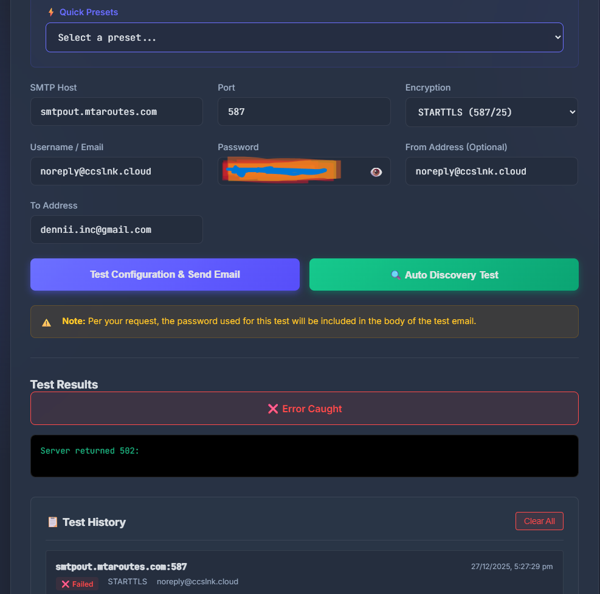
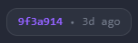

# 📧 Advanced SMTP Tester


> **A premium, powerful SMTP testing utility for developers and sysadmins.**  
> Test configurations, debug connection issues, and visualize results with a modern, beautiful interface.

<div align="center">

[](https://advanced-smtp-tester.beyondcloud.technology/)
[](https://github.com/DeNNiiInc/Advanced-Smtp-Tester)
[](LICENSE)

</div>

---

## ✨ Features

### 🎨 Modern User Interface
- **Premium Design** - Glassmorphism effects, smooth animations, and a polished UI.
- **Dark/Light Mode** - Toggle between themes with automatic persistence.
- **Responsive** - Works perfectly on desktop and mobile devices.



### 🚀 Powerful Testing Tools
- **Auto-Discovery** - Automatically test multiple port (25, 465, 587, 2525) and encryption (SSL/TLS, STARTTLS) combinations in one click.
- **Quick Presets** - Pre-configured settings for **Office 365, Gmail, SendGrid, Mailgun, and Amazon SES**.
- **Enhanced Error Handling** - Intelligent error analysis that provides actionable troubleshooting tips.

### 📊 History & Insights
- **Local Test History** - Automatically saves your recent tests (locally) for quick re-testing.
- **Detailed Logs** - View full SMTP transaction logs and server responses.
- **Git Version Badge** - Always know which version is deployed with the live Git commit badge.



---

## 🌐 Live Demo

Try the application instantly on our production server:
**[https://advanced-smtp-tester.beyondcloud.technology/](https://advanced-smtp-tester.beyondcloud.technology/)**

---

## 🛠️ Installation & Usage

### Option 1: Run Locally (Node.js)

1.  **Clone the repository**
    ```bash
    git clone https://github.com/DeNNiiInc/Advanced-Smtp-Tester.git
    cd Advanced-Smtp-Tester
    ```

2.  **Install dependencies**
    ```bash
    npm install
    ```

3.  **Start the server**
    ```bash
    npm start
    ```
    Access the app at `http://localhost:3000`

### Option 2: Desktop App (Electron)

You can run the application as a standalone desktop app.

```bash
# Run in development mode
npm run electron

# Build Windows Installer
npm run build
```

### Option 3: Proxmox Deployment (Automated)

We provide a fully automated deployment script for **TurnKey Linux Node.js** containers on Proxmox.

1.  **Setup Secrets**: Create `deploy-secrets.json` (see `PROXMOX_DEPLOY_TEMPLATE.md`).
2.  **Run Deploy Script**:
    ```powershell
    ./deploy-to-proxmox.ps1
    ```
    This script handles:
    -   Installing system dependencies (Git, Nginx, PM2, Cloudflared).
    -   Configuring Nginx reverse proxy.
    -   Setting up a cron job for **auto-updates every 5 minutes**.

👉 **[Read the Full Deployment Guide](PROXMOX_DEPLOY_TEMPLATE.md)**

---

## 🔒 Security Note

This application is designed for testing purposes.
-   **Passwords are processed in memory only** on the server side to attempt the SMTP connection.
-   **No credentials are stored** on the server.
-   **Test History** is stored **locally in your browser** (IndexedDB). clearing your browser cache will clear your history.
-   The "Unencrypted" option is provided for legacy server testing but should be used with caution.

---

## 🤝 Contributing

Contributions are welcome! Please feel free to submit a Pull Request.

1.  Fork the project
2.  Create your feature branch (`git checkout -b feature/AmazingFeature`)
3.  Commit your changes (`git commit -m 'Add some AmazingFeature'`)
4.  Push to the branch (`git push origin feature/AmazingFeature`)
5.  Open a Pull Request

---

## 📄 License

This project is licensed under the ISC License.

---

<div align="center">
  <p>Built with ❤️ by <strong>Beyond Cloud Technology</strong></p>
  <a href="https://www.youtube.com/@beyondcloudtechnology">YouTube Channel</a> • 
  <a href="https://beyondcloud.technology">Website</a>
</div>
