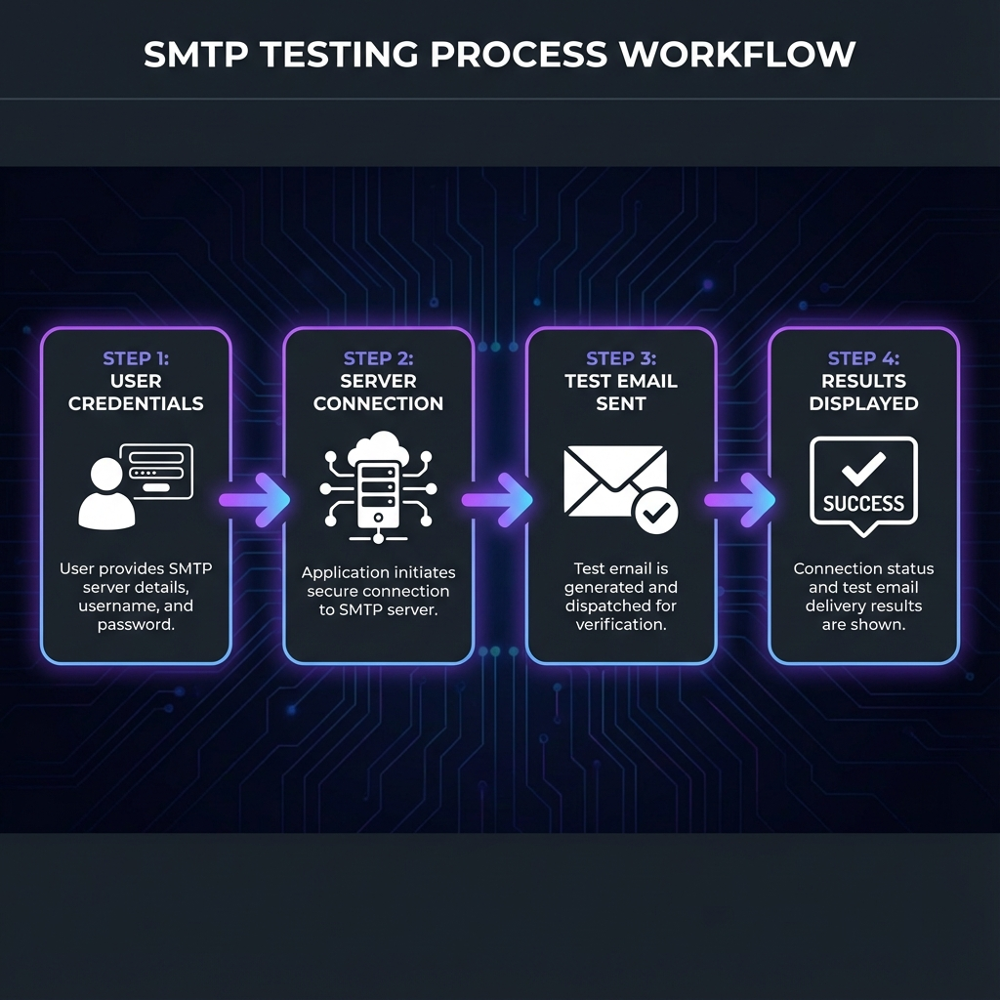
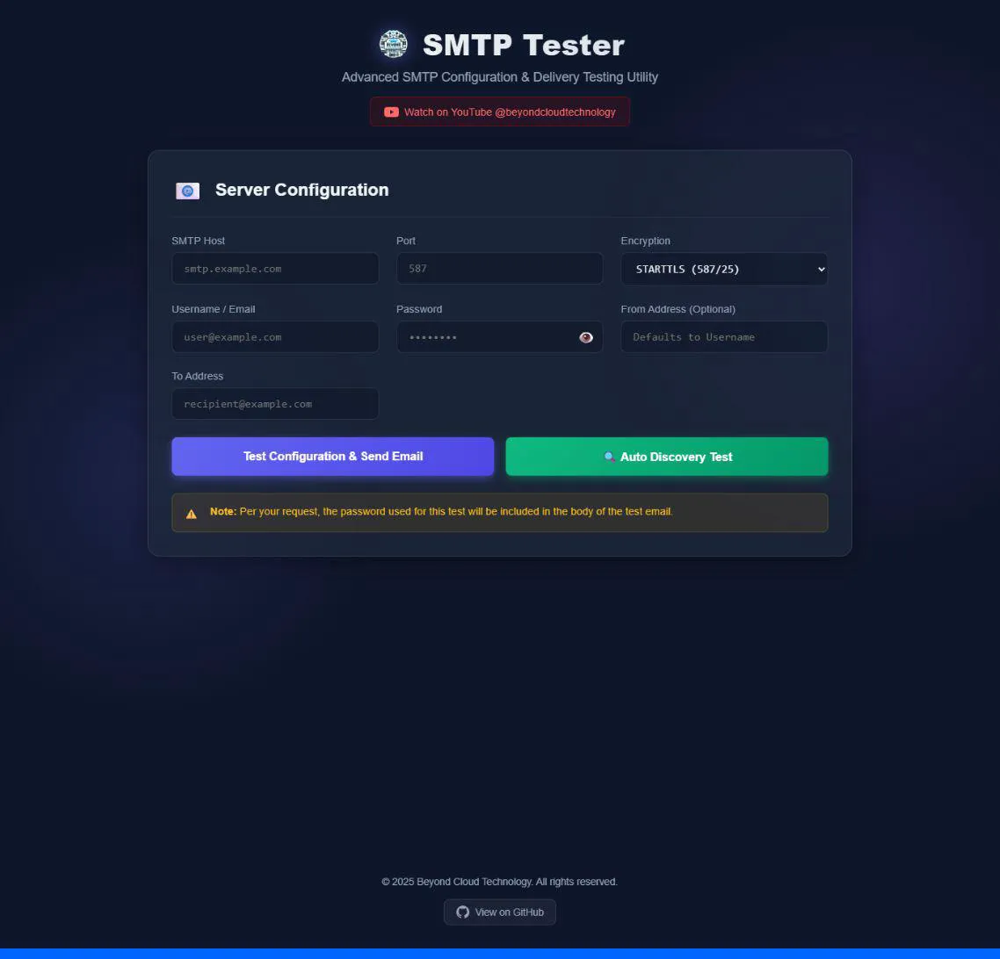
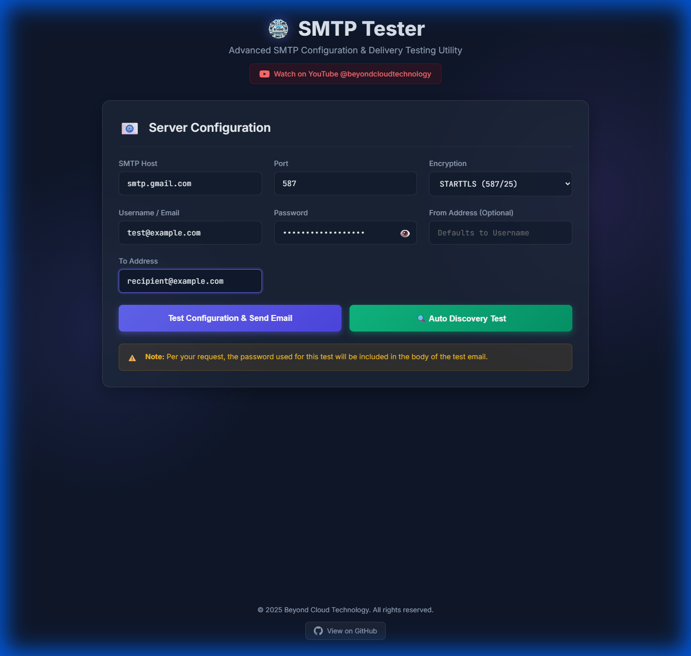
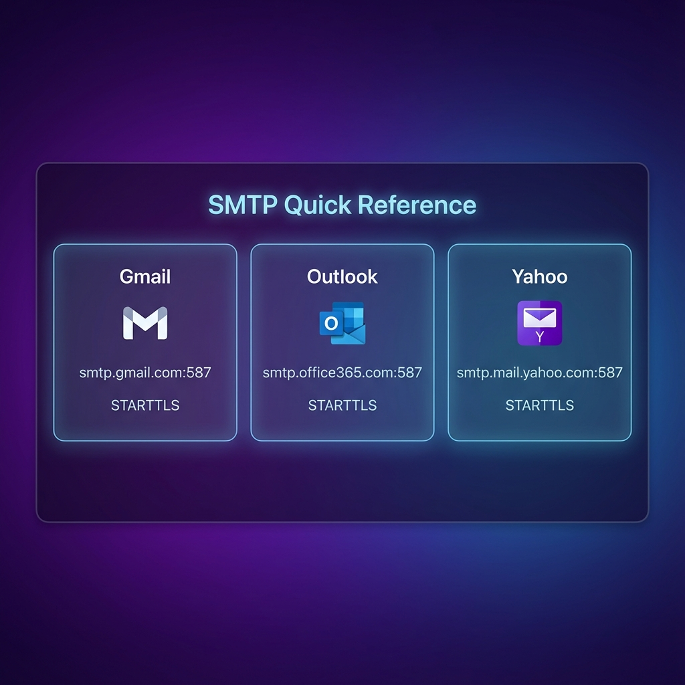

# Advanced SMTP Tester


[](https://www.gnu.org/licenses/gpl-3.0)
[](https://nodejs.org/)
[](https://github.com/DeNNiiInc/Advanced-Smtp-Tester)

A professional, feature-rich SMTP testing utility with a modern web interface. Test your email server configurations, troubleshoot delivery issues, and discover optimal SMTP settings automatically.

---

## 📋 Table of Contents

- [Features](#-features)
- [Screenshots](#-screenshots)
- [Installation](#-installation)
- [Usage](#-usage)
- [Configuration Examples](#-configuration-examples)
- [API Endpoints](#-api-endpoints)
- [Security Notes](#-security-notes)
- [Troubleshooting](#-troubleshooting)
- [Contributing](#-contributing)
- [License](#-license)

---

## ✨ Features

### 🔐 Comprehensive SMTP Support
- **Multiple Encryption Methods**: STARTTLS, SSL/TLS, and unencrypted connections
- **Common Ports**: Pre-configured support for ports 587, 465, 25, and 2525
- **Custom Configurations**: Flexible settings for any SMTP server

### 🔍 Auto-Discovery Testing
- Automatically tests multiple SMTP configurations
- Intelligently tries common port and encryption combinations
- Reports all successful configurations
- Sends test emails for each working setup

### 📧 Email Testing
- Sends styled HTML test emails
- Includes configuration details in email body
- Password included for verification (configurable)
- From/To address customization

### 🎨 Modern User Interface
- Clean, intuitive design
- Responsive layout for all devices
- Real-time status updates
- Animated background effects
- Dark theme optimized for extended use

### 🛡️ Security Features
- Password visibility toggle
- Secure encryption options
- Warning notifications for sensitive data
- No credential storage

---

## � How It Works



The SMTP testing process is simple and straightforward:

1. **Enter Credentials** - Provide your SMTP server details and authentication
2. **Connect to Server** - Application establishes secure connection to SMTP server
3. **Send Test Email** - Formatted test email is sent through the configured server
4. **View Results** - Detailed success/failure information displayed in real-time

---

## �📸 Screenshots

### Main Interface

*Clean, modern interface for SMTP configuration*

### Form Example

*Example configuration with Gmail SMTP settings*

---

## 🚀 Installation

### Prerequisites
- **Node.js** (v14.0.0 or higher)
- **npm** (comes with Node.js)

### Quick Start

1. **Clone the repository**
   ```bash
   git clone https://github.com/DeNNiiInc/Advanced-Smtp-Tester.git
   cd Advanced-Smtp-Tester
   ```

2. **Install dependencies**
   ```bash
   npm install
   ```

3. **Start the server**
   ```bash
   npm start
   ```

4. **Open in browser**
   ```
   http://localhost:3000
   ```

The application will be running on port 3000 by default.

---

## 📖 Usage

### Manual Configuration Test

1. **Enter SMTP Server Details**
   - **Host**: Your SMTP server address (e.g., `smtp.gmail.com`)
   - **Port**: SMTP port number (e.g., `587` for STARTTLS)
   - **Encryption**: Choose appropriate encryption method
     - STARTTLS (587/25) - Most common for modern servers
     - SSL/TLS (465) - Legacy secure connection
     - Unencrypted - Not recommended for production

2. **Provide Authentication**
   - **Username/Email**: Your email address or username
   - **Password**: Account password or app-specific password

3. **Configure Email Details**
   - **From Address** (Optional): Defaults to username if not specified
   - **To Address**: Recipient email for the test

4. **Run Test**
   - Click **"Test Configuration & Send Email"**
   - Wait for results (typically 5-15 seconds)
   - Check the results panel for success or error messages

### Auto-Discovery Test

For when you're not sure which configuration to use:

1. **Enter Basic Details**
   - SMTP Host
   - Username/Password
   - To Address

2. **Click "🔍 Auto Discovery Test"**

3. **Review Results**
   - The tool will test multiple port/encryption combinations
   - Successful configurations will send test emails
   - All working setups will be reported

---

## 🔧 Configuration Examples


*Quick reference for popular email providers*

### Gmail

```
Host:       smtp.gmail.com
Port:       587
Encryption: STARTTLS (587/25)
Username:   your-email@gmail.com
Password:   your-app-password
```

> **Note**: Gmail requires [App Passwords](https://support.google.com/accounts/answer/185833) when 2FA is enabled.

### Outlook/Office 365

```
Host:       smtp.office365.com
Port:       587
Encryption: STARTTLS (587/25)
Username:   your-email@outlook.com
Password:   your-password
```

### Yahoo Mail

```
Host:       smtp.mail.yahoo.com
Port:       587
Encryption: STARTTLS (587/25)
Username:   your-email@yahoo.com
Password:   your-app-password
```

### Custom SMTP Server

```
Host:       mail.yourdomain.com
Port:       587 (or 465, 25, 2525)
Encryption: Based on your server config
Username:   user@yourdomain.com
Password:   your-password
```

---

## 🔌 API Endpoints

### POST `/api/test-smtp`

Test a specific SMTP configuration and send an email.

**Request Body:**
```json
{
  "host": "smtp.gmail.com",
  "port": 587,
  "secure": "false",
  "user": "your-email@gmail.com",
  "pass": "your-password",
  "from": "sender@example.com",
  "to": "recipient@example.com"
}
```

**Response:**
```json
{
  "success": true,
  "message": "Email sent successfully!",
  "info": {
    "accepted": ["recipient@example.com"],
    "messageId": "<message-id>"
  }
}
```

### POST `/api/auto-test-smtp`

Automatically test multiple SMTP configurations.

**Request Body:**
```json
{
  "host": "smtp.gmail.com",
  "user": "your-email@gmail.com",
  "pass": "your-password",
  "to": "recipient@example.com"
}
```

**Response:**
```json
{
  "success": true,
  "results": [
    {
      "port": 587,
      "secure": "false",
      "status": "success",
      "message": "Email sent successfully!"
    }
  ]
}
```

---

## 🔒 Security Notes

> [!WARNING]
> **Password Transmission**
> By default, the test email includes the password used for testing in the email body. This is intentional for verification purposes but should be used carefully.

### Best Practices

1. **Use App-Specific Passwords**
   - Don't use your main account password
   - Create dedicated app passwords for testing

2. **Avoid Public Networks**
   - Don't test on public WiFi
   - Use VPN when possible

3. **Delete Test Emails**
   - Remove test emails containing passwords
   - Clear sent items after testing

4. **Local Hosting Only**
   - By default, runs on localhost only
   - Do not expose to the internet without proper security

5. **HTTPS in Production**
   - Use reverse proxy (nginx, Apache) for HTTPS
   - Never send credentials over unencrypted connections

---

## 🐛 Troubleshooting

### Common Issues

#### "Connection timeout" or "ETIMEDOUT"
- **Cause**: Firewall blocking SMTP ports
- **Solution**: 
  - Check firewall settings
  - Try different ports (587, 465, 25)
  - Contact your hosting provider

#### "Invalid login" or "Authentication failed"
- **Cause**: Incorrect credentials or security settings
- **Solution**:
  - Verify username and password
  - Use app-specific passwords
  - Enable "Less secure apps" (not recommended)
  - Check for 2FA requirements

#### "Self-signed certificate" errors
- **Cause**: Server using self-signed SSL certificate
- **Solution**:
  - Try unencrypted connection for testing
  - Update to use proper SSL certificates

#### Gmail "Username and Password not accepted"
- **Cause**: Gmail security blocks
- **Solution**:
  - Enable 2-Step Verification
  - Create App Password
  - Use the App Password instead of account password

### Debug Mode

Check the browser console (F12) for detailed error messages. Server logs will show in the terminal where you ran `npm start`.

---

## 🤝 Contributing

Contributions are welcome! Please follow these guidelines:

1. **Fork the repository**
2. **Create a feature branch**
   ```bash
   git checkout -b feature/your-feature-name
   ```
3. **Commit your changes**
   ```bash
   git commit -m "Add your feature description"
   ```
4. **Push to your branch**
   ```bash
   git push origin feature/your-feature-name
   ```
5. **Open a Pull Request**

### Development Setup

```bash
# Install dependencies
npm install

# Start development server
npm start

# The server runs with auto-reload enabled
```

---

## 📄 License

This project is licensed under the **GNU General Public License v3.0**.

```
Advanced SMTP Tester - Professional Email Configuration Testing
Copyright (C) 2025 Beyond Cloud Technology

This program is free software: you can redistribute it and/or modify
it under the terms of the GNU General Public License as published by
the Free Software Foundation, either version 3 of the License, or
(at your option) any later version.

This program is distributed in the hope that it will be useful,
but WITHOUT ANY WARRANTY; without even the implied warranty of
MERCHANTABILITY or FITNESS FOR A PARTICULAR PURPOSE.  See the
GNU General Public License for more details.
```

See the [LICENSE](LICENSE) file for full details.

---

## 🙏 Acknowledgments

- Built with [Node.js](https://nodejs.org/)
- Email functionality powered by [Nodemailer](https://nodemailer.com/)
- UI inspired by modern web design principles
- Developed by [Beyond Cloud Technology](https://github.com/DeNNiiInc)

---

## 📞 Support

- **Issues**: [GitHub Issues](https://github.com/DeNNiiInc/Advanced-Smtp-Tester/issues)
- **YouTube**: [@beyondcloudtechnology](https://www.youtube.com/@beyondcloudtechnology)
- **GitHub**: [@DeNNiiInc](https://github.com/DeNNiiInc)

---

<div align="center">

**Made with ❤️ by Beyond Cloud Technology**

[⭐ Star this repo](https://github.com/DeNNiiInc/Advanced-Smtp-Tester) | [🐛 Report Bug](https://github.com/DeNNiiInc/Advanced-Smtp-Tester/issues) | [✨ Request Feature](https://github.com/DeNNiiInc/Advanced-Smtp-Tester/issues)

</div>
